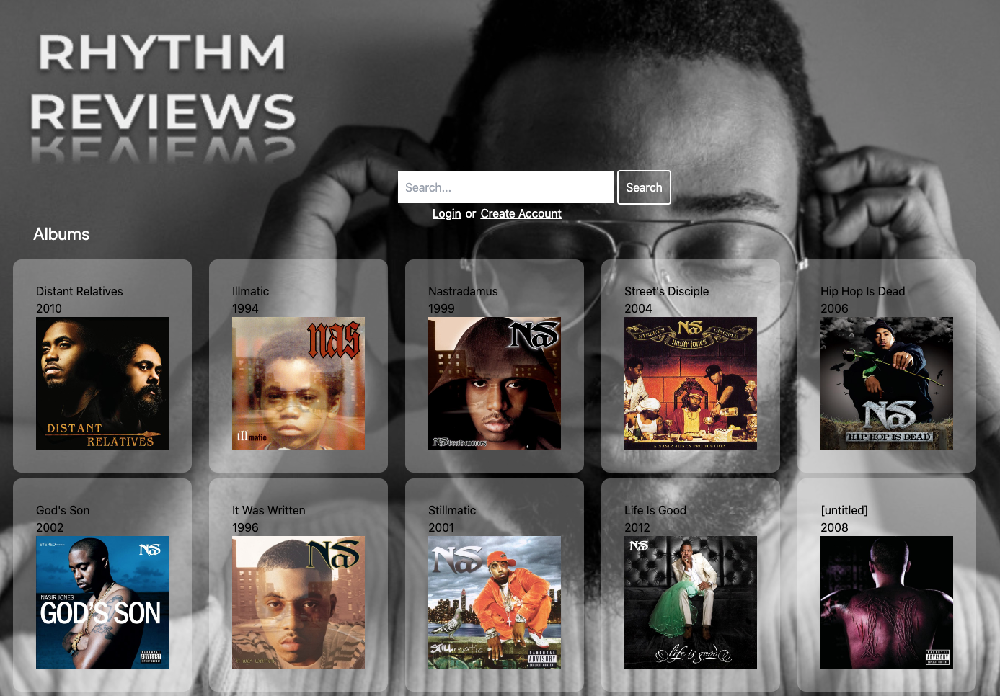

As a current student, I wanted to create a music review app that would help a user to add/remove/update reviews of music albums.  The Rhythm Reviews app would store necessary information and allow the user to save it and adjust their reviews accordingly.
##

## User Story

AS A music lover who writes about music\
I WANT to create a review site using REACT\
SO THAT I can publish reviews, on my thoughts and opinions of music albums
##

## Acceptance Criteria

GIVEN a review site created with React\
WHEN I visit the site for the first time\
THEN I am presented with the homepage, which includes a description of the app; navigation links and the option to log in\
WHEN I click on the homepage option\
THEN I am taken to the homepage\
WHEN I click on any other links in the navigation\
THEN I am prompted to either sign up or sign in\
WHEN I choose to sign up\
THEN I am prompted to create a username, email and password\
WHEN I click on the sign-up button\
THEN my user credentials are saved and I am logged into the site\
WHEN I revisit the site at a later time and choose to sign in\
THEN I am prompted to enter my email and password\
WHEN I am signed in to the site\
THEN I see navigation links for my profile and the option to log out\
WHEN I click on the homepage option in the navigation\
THEN I am taken to the homepage\
WHEN I click on an existing review\
THEN I am presented with the review title, contents, and review creator’s username for that review\
WHEN I click on the profile option in the navigation\
THEN I am taken to the profile and presented with any reviews I have already created and the option to add a edit or delete the review\
WHEN I search for an artist in the search bar\
THEN I am taken to the search results\
WHEN I click on the album I would like to review\
THEN I am prompted to enter both a title and contents for my review\
THEN the title and contents of my review are saved and I am taken back to an updated album page with my new review\
WHEN I click on one of my existing reviews in the profile\
THEN I am able to delete or update my review, and taken back to an updated profile\
WHEN I click on the logout option in the navigation\
THEN I am signed out of the site\
##

## Installation
There is no need to install anything, please use the link to the deployed app.\
[Rhythm Reviews](https://rhythm-reviews-v2-a30efa7f58da.herokuapp.com/)
##

## Usage
This app is meant to help the user quickly and easily add/update reviews on the music albums that they listen to.
##

## License:  NONE

## Screenshots:

  
*This is a screenshot of the login page*
##

  
*This is a screenshot of search results populated*
##

## Contact Me
To contact us connect through our github repo  
GitHub URL: https://github.com/group7-project2/rhythm-reviews

##

## Notes:
Background image courtesy of [cottonbro studio](https://www.pexels.com/photo/close-up-of-a-man-wearing-eyeglasses-listening-to-music-6700117/)

By: Ashley Zemina, Gil Rosario, Jen Stemkowski, Jason Torrealba, Florian Kreuk
=======
- [@vitejs/plugin-react](https://github.com/vitejs/vite-plugin-react/blob/main/packages/plugin-react/README.md) uses [Babel](https://babeljs.io/) for Fast Refresh
- [@vitejs/plugin-react-swc](https://github.com/vitejs/vite-plugin-react-swc) uses [SWC](https://swc.rs/) for Fast Refresh
